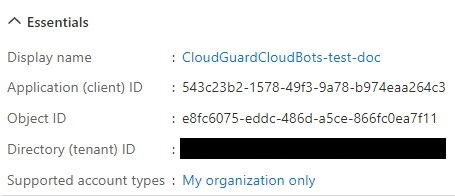
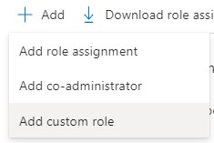
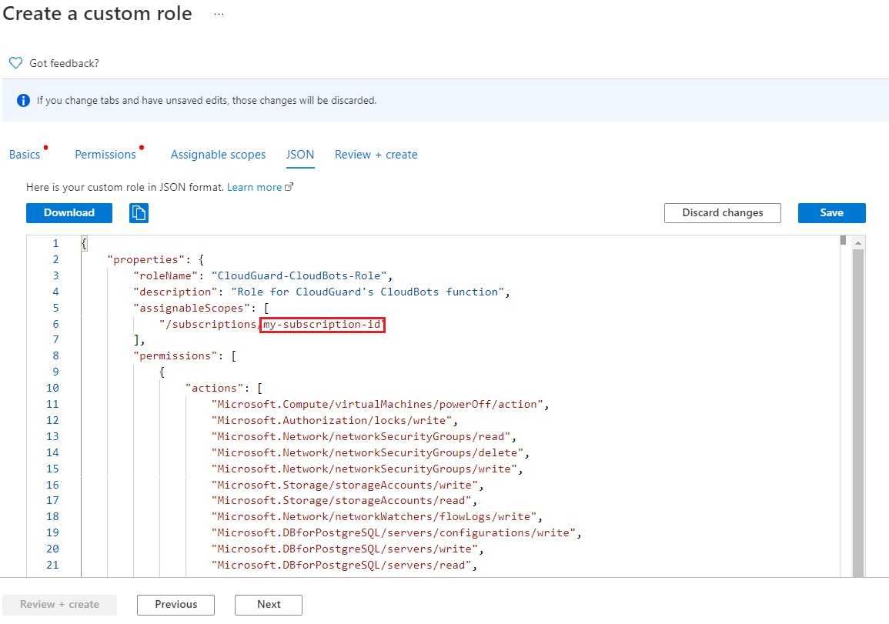
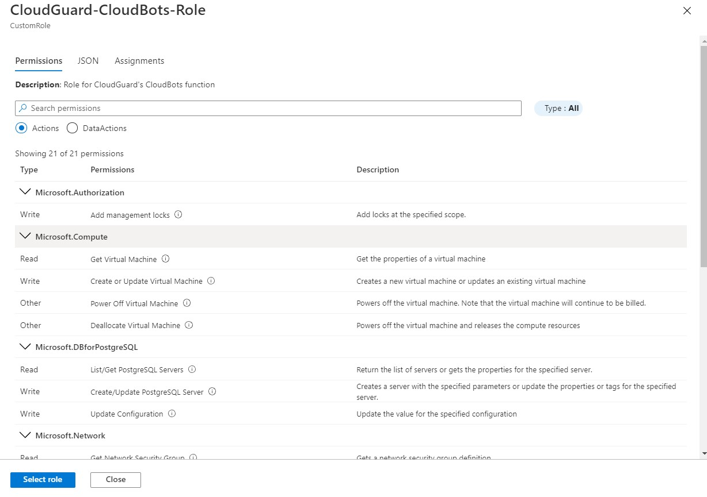
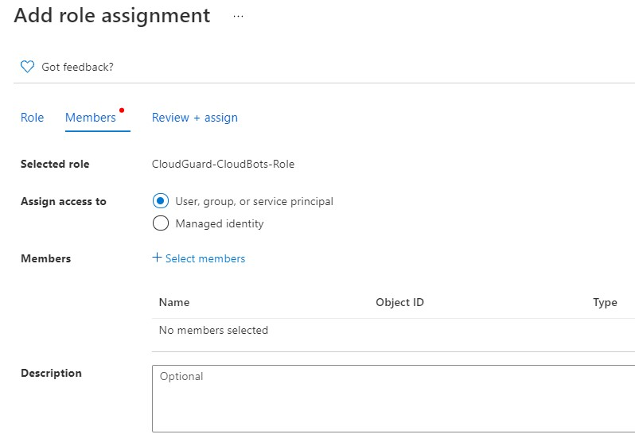
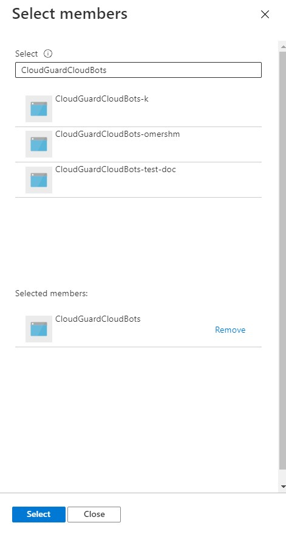
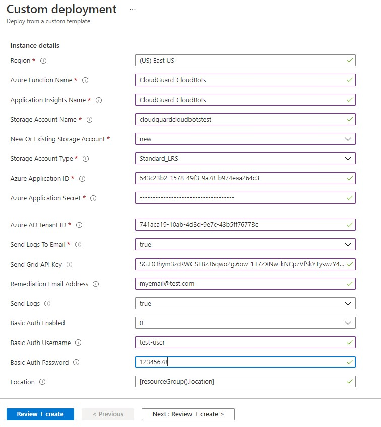

  - [What are Dome9 CloudBots?](#what-are-dome9-cloudbots)

    

    <h1><a target="_blank" href="https://cloudbots.dome9.com">CloudBots</a> is an automatic remediation solution for public cloud platforms (Azure, <a href="https://github.com/Dome9/cloud-bots" targe="_blank">AWS</a>, and <a href="https://github.com/Dome9/cloud-bots-gcp" targe="_blank">GCP</a>)</h1>

  - [Flow Diagram](#flow-diagram)
      - [The Bots](#the-bots)
  - [Deploy the CloudBots to your Azure
    accounts](#deploy-the-cloudbots-to-your-azure-accounts)
      - [Setup your Azure subscriptions for
        CloudBots](#setup-your-azure-subscriptions-for-cloudbots)
      - [Multiple Accounts](#multiple-accounts)
  - [Setup your Dome9 account](#setup-your-CloudGuard-account)
      - [Configure the rules](#configure-the-rules)
      - [Configure a Continuous Compliance
        policy](#configure-a-continuous-compliance-policy)
  - [Update the CloudBots code](#update-the-cloudbots-code)
  - [Log Collection for
    Troubleshooting](#log-collection-for-troubleshooting)
  - [What are CloudGuard CloudBots?](#what-are-CloudGuard-cloudbots)
      - [Flow Diagram](#flow-diagram)
          - [The Bots](#the-bots)
      - [Onboarding](#onboarding)
          - [Setup your Azure account for
            CloudBots](#setup-your-azure-account-for-cloudbots)
          - [Multiple Accounts](#multiple-accounts)
      - [Setup your CloudGuard account](#setup-your-CloudGuard-account)
          - [Configure the rules](#configure-the-rules)
          - [Configure the Continuous Compliance
            policy](#configure-the-continuous-compliance-policy)
      - [Log Collection for
        Troubleshooting](#log-collection-for-troubleshooting)

## What are CloudGuard CloudBots?

Cloud-Bots is an auto remediation solution for Azure, built on top of
the CloudGuard Native Continuous Compliance capabilities.

They can also be used standalone, without CloudGuard, to remedy issues in Azure
subscriptions. Details are included how to configure and trigger them.

# Flow Diagram

## The Bots

Refer to [this](dome9CloudBots/bots/bots.md) file for a list of the
bots, what each one does, and an example of a rule that could be used to
trigger it.

# Deploy the CloudBots to your Azure accounts

To use the CloudBots in your Azure accounts, you must setup your account
and your CloudGuard account.

## Setup your Azure subscriptions for CloudBots

Follow these steps to configure your Azure subscriptions to use CloudGuard
CloudBots:

  - Install Python and dependent packages needed by the Cloudbots
  - Create a new Azure app registration for CloudBots
  - Optionally, create a SendGrid account to forward email notifications
  - Create a custom role for the CloudBots Function
  - Assign IAM roles for the app registration created above
  - Create an empty Azure function for the CloudBots
  - Deploy the CloudBots in the Azure subscription

<!-- end list -->

1.  Install Dependencies

    **Note:** If you already have Azure CLI and Azure functions make sure to use the latest versions
    1.  [Azure
        CLI](https://docs.microsoft.com/en-us/cli/azure/install-azure-cli?view=azure-cli-latest),
        and then login to your Azure account
    2.  [Azure Functions Core
        Tools](https://github.com/Azure/azure-functions-core-tools)
    3.  [Python 3.6.X or higher](https://www.python.org/)
    4.  [NodeJS \> 8.5](https://nodejs.org/en/download)
    5.  [Microsoft .NET core
        \> 2.2](https://dotnet.microsoft.com/download/dotnet-core)
        

2.  Create Azure App Registration:
    
    1.  In the Azure portal, navigate to App registrations, and the
        click *New registration*.
        
    2.  Enter a name for the app (for example, *CloudGuardCloudBots*), then
        click *Register*.
        
    3.  Save the *Application (client) ID* and *Directory (tenant) ID*.
        
    4.  Navigate to *Certificates & secrets*, from the left side menu,
        and click *New client secret* and click *Add*
        
    5.  Save the secret's *Value*.
        
        

3.  Create SendGrid, to be used to send remediation outputs by email
    (Optional)
    
    1.  In the Azure portal, navigate to *SendGrid Accounts*.
    2.  Click *Add*, and complete the signup form.
    3.  Select the new SendGrid account, and then click *Manage*.
    4.  Select *Settings -\> API Keys*, and then click *Create API Key.*
    5.  Enter a name (for example, *CloudGuardCloudBots*), select *Full
        Access*, then click *Create & View*.
    6.  Save the key value (will be needed in a later step).
    
    
4.  Create a custom role for the CloudBots Function
    
    1.  In the Azure Portal, navigate to *Subscriptions*.
    2.  Select the subscription that will use the CloudBots.
    3.  Select *Access control (IAM)* from the menu on the left.
    4.  Click *Add* -\> *Add custom role*
    
    

    5. Go to *JSON* section.
    6. Click on *Edit* (in the top-right corner of the text box)
    7. Copy the JSON object from the file: [CloudGuard-CloudBots-Role.json](CloudGuard-CloudBots-Role.json)
    8. In the *assignableScopes* property, fill in your subscription id in the marked place.
    
       
    9. Press *Save* (in the top-right corner).
    10. Press *Review + create* (at the bottom).
    11. Check the permissions granted and press *Create*.
    12. Repeat these steps for each additional Subscription.
    

5.  Assign Roles
    
    1.  Navigate to *Subscriptions*.
    2.  Select the subscription that will use the CloudBots.
    3.  Select *Access control (IAM)* from the menu on the left.
    4.  Click *Add* -\> *Add role assignment*
        
        
    5.  Search for the role you created in the last step and press on *View*.
        
        
    6.  Press on *Select role*.
        
        
    7.  Press on *Select members*.
        
        
    8.  Select the App Registration you created earlier.
        
        
    9.  Press on *Review +assign*.
    10.  Repeat these steps for each additional Subscription.

6.  Create an Azure Function App

    1.  Clone the CloudBots Azure code from
         [GitHub](https://github.com/Dome9/cloud-bots-azure) *(git clone https://github.com/dome9/cloud-bots-azure.git)*

    2.  Click the "Deploy to Azure" button and fill out the deployment form

    3.  Both the Azure Function name and the Storage Account name **must be globally unique or deployment will fail (if a new storage account is created)**
    
    
    
    4.  Once the ARM template deployment is complete, open a command prompt and navigate to the *cloud-bots-azure* folder
    
    5.  Install the Azure Functions command line tools (*https://docs.microsoft.com/en-us/azure/azure-functions/functions-run-local?tabs=windows%2Ccsharp%2Cbash*)

    6.  Run *func init*
    
    7.  Run *func azure functionapp publish ***functname**** where the functname is your function name from the "***Deploy to Azure***" workflow. This will take a few minutes to complete. Be patient - get a coffee!
    
    
    
## Multiple Accounts

If you are deploying CloudBots on several Azure subscriptions, repeat
step 4 (Assign Roles), above, for each subscription.

# Setup your CloudGuard account

On CloudGuard you must add remediation definitions to rules in a compliance ruleset. Refer to the latest CloudGuard documentation on how to do this (https://sc1.checkpoint.com/documents/CloudGuard_Dome9/Documentation/PostureManagement/Remediation.htm#microcontent1).

## Configure the Remediation

Follow these steps in your CloudGuard account to tag the compliance rules &
rulesets to use bots as a remediation step.

1.  In the CloudGuard web app, navigate to the **Remediation** page in the
    Posture Management menu.

2.  Click **Create New Remediation**, in the upper right.

3.  Select the rules for which the remediation applies, from the given options. The options can be combined, and the effective rules on which the remediation applies are the combination of all the selected options.
    - A Ruleset (mandatory)
    - A specific Rule in the ruleset (optional, if missing, all rules are implied)
    - A specific Entity, by its entity ID (optional, if missing, all entities are implied); this selects all rules involving the selected entities
    - A specific Cloud Account, this applies the remediation to rules in the selected ruleset only when the ruleset is applied to the selected cloud accounts.
    - Select the CloudBot, from the list. If the cloudbot is not in the list, select Custom, and then add the name of the cloudbot, along with the runtime arguments**. The cloudbot must be deployed in the selected cloud account, in the same folder as the other bots.
    - Add a comment and then click **Save**.
    
** Example for using a custom bot:

## Configure a Continuous Compliance policy

Once the rules in the ruleset have been tagged for remediation, set up a
Continuous Compliance policy to run the ruleset, and send findings the
Azure function webhook.

1.  Navigate to the **Policies** page in the Compliance & Governance
    menu.
2.  Click **ADD POLICY** (on the right).
3.  Select the account from the list, then click **NEXT**, this will be
    the one account in which the bots are deployed.
4.  Select the ruleset from the list, then click **NEXT**.
5.  Click **ADD NOTIFICATION**.
6.  Select *Send to HTTP Endpoint* and enter the URL from the Function
    App and then click **SAVE**.

**Note:** CloudGuard will send event messages to the webhook for new
findings. To send events for previous findings, follow these steps:

1.  Navigate to the **Policies** page.
2.  Find the ruleset and account in the list, and hover over the right
    of the row, then click on the *Send All Alerts* icon.
3.  Select the *webhook* Notification Type option, and the Notification
    Policy (the one created above), then click **SEND**. CloudGuard will send
    event messages to the Azure function webhook.

# Update the CloudBots code

See [Update CloudBots Function App](https://github.com/dome9/cloud-bots-azure/blob/IN-823-update_function_script/scripts/README.md#Update CloudBots Function App)

# Log Collection for Troubleshooting

The cloudbots send log information to CloudGuard, that is used for
troubleshooting. By default, this is enabled for all bots. You can
disable this in your Azure account. Select the function, and set the
environment variable SEND\_LOGS to False. This will apply to all bots in
the account. By default, this is set to True, enabling logs.

Each account is controlled by the variable for the function configured
in that account.
